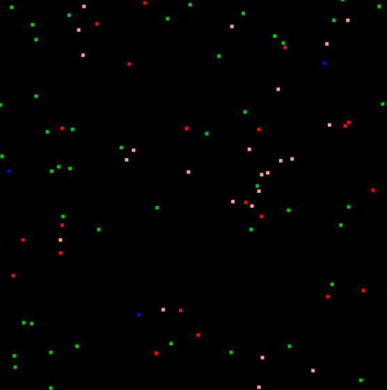

# **Spreading virus simulation**

The point of this simulation was to learn how to use the State design pattern.

### Technologies

- Python 3.9
- Pyglet

## Simulation

### Start

Simulation starts with 100 healthy (green objects) people moving in the area. 
On the borders of the area new people appear, with a 10% probability to have a virus, in 50% cases with symptoms (red objects) and in the other 50% without them (light red objects).

### Spreading the disease

If a symptomatically ill person stays within a close range to a healthy one for 3 seconds straight, the virus will spread with a 100% probability.
If a person was asymptomatically ill, then the healthy person will become ill with 50% probability.

In either case, if someone becomes ill, there is 50% chance for the illness to be symptomatic and 50% chance to be asymptomatic.

### Getting immunity

Ill person acquires immunity (blue objects) after 20-30 seconds of being ill.

### Movement of the people

Every person has its own 2d vector, that can be randomly changed with 5% chance every 0.04 second.
Once someone hits border, he has 50% chance to get back into area and 50% chance to get out of it.